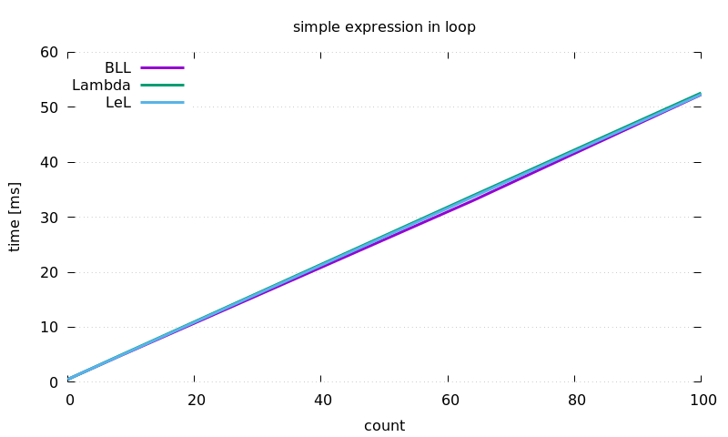
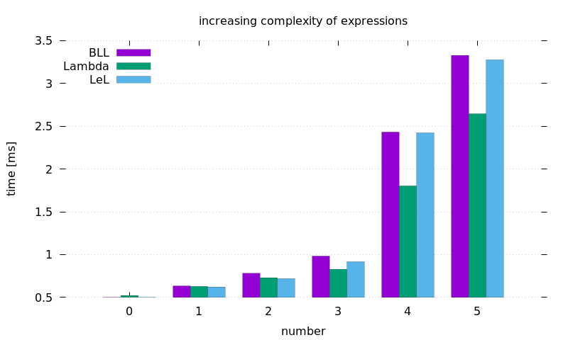
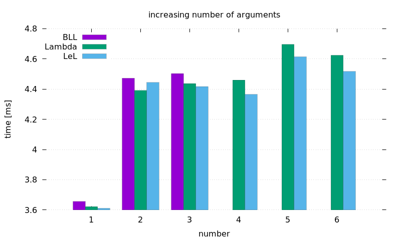

# LeL

> Lambda Expression Library
> > Single header (after fusing) library with no external dependencies.

```cpp
auto is_right_triangle = _a * _a + _b *_b == _c * _c;

is_right_triangle(3, 4, 5);
```

[![Language][Language-img]][Language-url]
[![Release][Release-img]][Release-url]
[![License][License-img]][License-url]

[![Master][Master-img]][Master-url]
[![MasterLinuxBuild][MasterLinuxBuild-img]][MasterLinuxBuild-url]
[![MasterWindowsBuild][MasterWindowsBuild-img]][MasterWindowsBuild-url]
[![MasterCoverage][MasterCoverage-img]][MasterCoverage-url]
[![MasterCodeClimate][MasterCodeClimate-img]][MasterCodeClimate-url]

[![Develop][Develop-img]][Develop-url]
[![DevelopLinuxBuild][DevelopLinuxBuild-img]][DevelopLinuxBuild-url]
[![DevelopWindowsBuild][DevelopWindowsBuild-img]][DevelopWindowsBuild-url]
[![DevelopCoverage][DevelopCoverage-img]][DevelopCoverage-url]

---

# About

Lambda functions in c++ are cool, very cool. But they give quite some overhead
in syntax requirements, which obscures very little functions. Consider:

```cpp
auto is_even = [](auto i) { return i % 2 == 0; };
```

It is very short, nice lambda, but the actual condition is only around half of
its body. Now lets see how it would look in lambda expression:

```cpp
auto is_even = _i % 2 == 0;
```

Shorted, right? And, for me, much cleaner.

## Examples

```cpp

// simple
auto plus_one = _x + 1;
auto multiply = _x * _y;
auto is_less  = _1 < _2;

// more arguments
auto compute_something = 1 + _x * 3 - _y * _y + _x * _z;

// make own placeholders
auto first_arg  = LeL::Placeholder<'1'>();
auto second_arg = LeL::Placeholder<'2'>();

auto not_equal = first_arg != second_arg;

// some more... complexity...

auto sum = *((*_x)[_1]) + **(_y[_2]);

std::unique_ptr<std::vector<std::unique_ptr<int>>> x = ...;
std::vector<std::unique_ptr<std::unique_ptr<int>>> y = ...;

sum(1, 2, x, y);

// for references we need a wrapper

int x = 5;

auto add_to_x = _(x) += _y;

add_to_x(8);

```

# Usage

**Files** There are two ways of including **LeL**:
 * in multiple headers, as it is in repository;

   everything is in `include` directory
 * in one fused-header;

   `script/fuse` will fuse all into `build/lel.hpp`


**API** The only things that should be used are:
  * `LeL::Placeholder`            - template alias for placeholders creation
  * `LeL::Reference`              - class for wrapping objects in a reference
  * `namespace LeL::Placeholders` - with predefined placeholders
    * `_`                         - instance of `LeL::Reference` class
    * `_1` ... `_9`               / instances of `LeL::Placeholder` class
    * `_A` ... `_Z`               | 
    * `_a` ... `_z`               /

```cpp
#include "lel.hpp"

auto use_with_namespace = LeL::Placeholders::_x + 2;

auto create_your_own    = LeL::Placeholder<'a'>();

// or use namespace
using namespace LeL::Placeholders;
auto like_that          = 1 * _2;
```

**Implementation** Templates, so many templates. Cool stuff!

The separate types of placeholders are distinguist by template variable
**char**. So `Placeholder<'a'>` and `Placeholder<'A'>` are different types.

You can use any combination of them (only numbers, numbers and letters,
etc) in any order or degree. The important thing is the arguments during
evaluation will be assigned with alphabetic (ASCII alphabetic) order.

So:
```cpp
auto expr = _1 - _x;

assert(-1 == expr(2, 3));
assert( 1 == expr(3, 2));
```

# Tests

There is a bunch of tests but they are not needed for normal usage. You can run
all of them with **cmake**:

```bash
mkdir build
cd build
cmake .. -DTESTS=ON
cmake --build .
ctest -VV
```

# Benchmarks



```
expression == x * x + 3
```

```cpp
std::vector<int> vec(100);
std::generate(vec.begin(), vec.end(), std::rand);

while (state.KeepRunning()) {
  for (int i = 0; i <= count; ++i) {
    std::transform(vec.begin(), vec.end(), vec.begin(), expression);
  }
}
```



```
0 == ax
1 == ax + x
2 == ax - (a+x)
3 == (ax - (a+x))(a+x)
4 == ((ax) - (a+x))(bx - (b+x))(ax - (b+x))(bx - (a+x))
```

```cpp
std::vector<double> vec(100);
std::generate(vec.begin(), vec.end(), std::rand);

while (state.KeepRunning()) {
  std::transform(vec.begin(), vec.end(), vec.begin(), expression);
}
```



```
((ax) - (a+x))(bx - (b+x))(ax - (b+x))(bx - (a+x))
```

```cpp
std::vector<double> vec(100);
std::generate(vec.begin(), vec.end(), std::rand);

for (int i = 0; i < 1000; ++i) {
  expression(vec[args]...);
}
```

# BLL - Boost Lambda Library?

Yes, the same concept but this one uses a little bit newer C++.
However the idea for this library came out independently.

---

[Language-img]: https://img.shields.io/badge/language-C++14-d65d0e.svg?style=flat-square
[Language-url]: https://isocpp.org
[Release-img]: https://img.shields.io/github/release/dawikur/lel.svg?style=flat-square
[Release-url]: https://github.com/dawikur/lel/releases
[License-img]: https://img.shields.io/github/license/dawikur/lel.svg?style=flat-square
[License-url]: https://github.com/dawikur/lel/blob/master/LICENSE

[Master-img]: https://img.shields.io/badge/-%20master-grey.svg?style=flat-square
[Master-url]: https://github.com/dawikur/lel
[MasterLinuxBuild-img]: https://img.shields.io/travis/dawikur/lel/master.svg?label=linux&style=flat-square
[MasterLinuxBuild-url]: https://travis-ci.org/dawikur/lel
[MasterWindowsBuild-img]: https://img.shields.io/appveyor/ci/dawikur/lel/master.svg?label=windows&style=flat-square
[MasterWindowsBuild-url]: https://ci.appveyor.com/project/dawikur/lel
[MasterCoverage-img]: https://img.shields.io/codecov/c/github/dawikur/lel/master.svg?label=coverage&style=flat-square
[MasterCoverage-url]: https://codecov.io/gh/dawikur/lel
[MasterCodeClimate-img]: https://img.shields.io/codeclimate/github/dawikur/lel.svg?style=flat-square
[MasterCodeClimate-url]: https://codeclimate.com/github/dawikur/lel/

[Develop-img]: https://img.shields.io/badge/-develop-lightgrey.svg?style=flat-square
[Develop-url]: https://github.com/dawikur/lel/tree/develop
[DevelopLinuxBuild-img]: https://img.shields.io/travis/dawikur/lel/develop.svg?label=linux&style=flat-square
[DevelopLinuxBuild-url]: https://travis-ci.org/dawikur/lel
[DevelopWindowsBuild-img]: https://img.shields.io/appveyor/ci/dawikur/lel/develop.svg?label=windows&style=flat-square
[DevelopWindowsBuild-url]: https://ci.appveyor.com/project/dawikur/lel
[DevelopCoverage-img]: https://img.shields.io/codecov/c/github/dawikur/lel/develop.svg?label=coverage&style=flat-square
[DevelopCoverage-url]: https://codecov.io/gh/dawikur/lel
